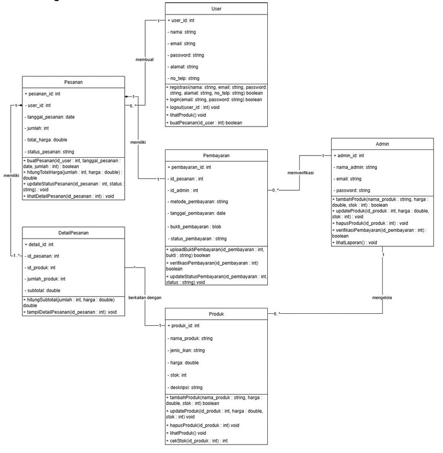

# Nila Prima Farm (Platform Sistem Penjualan Benih Ikan Nila Super) - RPL Kelompok 16 R4

## Anggota Kelompok

- Ahmad Sauqhi Badrani - M0405241068
- Ar Rasyid Ibrahim Huwaidi - M0405241072
- Ahsan Dzakwan Mahendra - M0405241076 (Frontend dan Backend)

---
## Apa itu Nila Prima Farm?

Nila Prima Farm adalah platform e-commerce berbasis web yang dirancang untuk membantu digitalisasi penjualan benih ikan nila secara modern dan efisien. Sistem ini memungkinkan pengguna untuk melihat produk, melakukan transaksi online, serta mengelola pembelian melalui dashboard yang terintegrasi.

Selain sebagai platform penjualan, Nila Prima Farm juga dilengkapi fitur analisis data dan prediksi penjualan berbasis Artificial Intelligence (AI). Model machine learning digunakan untuk membantu menganalisis pola penjualan dan memberikan insight bisnis berdasarkan data transaksi.

Project ini dikembangkan sebagai integrasi antara:
- Rekayasa Perangkat Lunak (RPL)
- Pengantar Sains Data (PSD)
- Pengantar Kecerdasan Buatan (PKB)

dengan tujuan membangun sistem full-stack yang tidak hanya berfungsi sebagai website penjualan, tetapi juga mendukung pengambilan keputusan berbasis data.

---
## Class Diagram



---
## ⚙️ Tech Stack

| Layer | Teknologi |
|---|---|
| Frontend | React 18, Vite, Tailwind CSS, React Router DOM, Axios, Heroicons |
| Backend | Node.js, Express.js, MySQL2, JWT, bcryptjs, Multer |
| Payment | Midtrans Snap (Sandbox/Production) |
| Email | Brevo (Sendinblue) API |
| WhatsApp | Fonnte API |

---

## 📁 Struktur Proyek

```
nila-prima-farm/
├── frontend/          ← React + Vite
│   ├── src/
│   │   ├── assets/
│   │   ├── components/    ProductCard, UI components
│   │   ├── context/       AuthContext, CartContext
│   │   ├── data/          dummy.js (seed data & helpers)
│   │   ├── layouts/       MainLayout, AdminLayout
│   │   ├── pages/         Semua halaman
│   │   │   └── admin/     Dashboard, Pesanan, Produk
│   │   ├── services/      api.js (Axios instance)
│   │   └── App.jsx        Routes
└── backend/           ← Node.js + Express
    ├── config/        database.js, multer.js
    ├── controllers/   auth, product, cart, order, payment, profile, admin
    ├── middleware/    auth, admin, error
    ├── routes/        Semua endpoint
    ├── uploads/       File gambar produk
    ├── utils/         brevo.js, fonnte.js
    ├── schema.sql     MySQL schema + seed data
    └── server.js
```

## Tampilan Fitur-Fitur

### 1. 

### 2.

### 3.

### 4. 

### 5.

---

## 🚀 Cara Menjalankan

### 1. Setup Database

```bash
mysql -u root -p < backend/schema.sql
```

### 2. Setup Backend

```bash
cd backend
cp .env .env.local   # isi semua variabel
npm install
npm run dev
```

Backend berjalan di: `http://localhost:5000`

### 3. Setup Frontend

```bash
cd frontend
cp .env.example .env   # isi VITE_MIDTRANS_CLIENT_KEY
npm install
npm run dev
```

Frontend berjalan di: `http://localhost:5173`

---

## 🔑 Environment Variables

### Backend `.env`

```env
PORT=5000

# MySQL
DB_HOST=localhost
DB_USER=root
DB_PASSWORD=yourpassword
DB_NAME=nila_prima_farm

# JWT
JWT_SECRET=your_jwt_secret_min_32_chars

# Midtrans Sandbox
MIDTRANS_SERVER_KEY=SB-Mid-server-xxxx
MIDTRANS_CLIENT_KEY=SB-Mid-client-xxxx
MIDTRANS_IS_PRODUCTION=false

# Brevo Email
BREVO_API_KEY=xkeysib-xxx
BREVO_SENDER_EMAIL=noreply@nilaprimafarm.id
BREVO_SENDER_NAME=Nila Prima Farm

# Fonnte WhatsApp
FONNTE_TOKEN=your_fonnte_token
ADMIN_PHONE=08xxxxxxxxxx

# Frontend URL
FRONTEND_URL=http://localhost:5173
```

### Frontend `.env`

```env
VITE_MIDTRANS_CLIENT_KEY=SB-Mid-client-xxxx
```

---

## 📋 API Endpoints

### Auth
```
POST   /api/auth/register
POST   /api/auth/login
```

### Products
```
GET    /api/products             — publik
GET    /api/products/:id         — publik
POST   /api/products             — admin
PUT    /api/products/:id         — admin
DELETE /api/products/:id         — admin
```

### Cart (auth required)
```
GET    /api/cart
POST   /api/cart
PUT    /api/cart/:id
DELETE /api/cart/:id
```

### Orders (auth required)
```
POST   /api/orders
GET    /api/orders
GET    /api/orders/:id
```

### Payment
```
POST   /api/payment/create       — auth required
POST   /api/payment/webhook      — Midtrans callback (no auth)
```

### Profile (auth required)
```
GET    /api/profile
PUT    /api/profile
```

### Admin (admin only)
```
GET    /api/admin/stats
GET    /api/admin/orders
GET    /api/admin/orders/:id
PUT    /api/admin/orders/:id
GET    /api/admin/users
```

---

## 🗺️ Frontend Routes

| Route | Halaman |
|---|---|
| `/` | Katalog produk + Hero section |
| `/login` | Login |
| `/register` | Register |
| `/produk/:id` | Detail produk |
| `/keranjang` | Keranjang belanja |
| `/checkout` | Form checkout |
| `/pembayaran` | Pembayaran Midtrans |
| `/riwayat` | Riwayat pesanan |
| `/profil` | Edit profil |
| `/admin` | Dashboard admin |
| `/admin/pesanan` | List pesanan |
| `/admin/pesanan/:id` | Detail pesanan |
| `/admin/produk` | Kelola produk |

---

## 💳 Flow Pembayaran Midtrans

```
Checkout → POST /api/orders
        → POST /api/payment/create  (generate snap_token)
        → window.snap.pay(token)    (popup Midtrans)
        → User bayar
        → Midtrans POST /api/payment/webhook
        → Update payment_status & order_status
        → Kirim email + WA notifikasi
```

---

## 📧 Email Notifications (Brevo)

| Event | Trigger |
|---|---|
| Registrasi | `sendWelcomeEmail` |
| Invoice pesanan | `sendOrderInvoiceEmail` |
| Pembayaran berhasil | `sendPaymentSuccessEmail` |
| Update status pesanan | `sendOrderStatusEmail` |

---

## 📱 WhatsApp Notifications (Fonnte)

| Event | Penerima |
|---|---|
| Pesanan dibuat | User + Admin |
| Pembayaran berhasil | User |
| Update status pesanan | User |
| Reminder checkout | User |

---

## 👤 Demo Akun

| Role | Email | Password |
|---|---|---|
| Admin | admin@nilaprimafarm.id | admin123 |
| User | user@demo.com | demo123 |

---

## 🔒 Catatan Keamanan

- JWT dengan expiry 7 hari
- Password di-hash dengan bcrypt (salt rounds: 12)
- Admin routes dilindungi `adminMiddleware`
- Midtrans webhook tidak memerlukan auth (IP whitelist di dashboard Midtrans)
- Untuk production: ganti semua key sandbox ke production key

---

## 📞 Kontak & Support

- 🌐 Website: nilaprimafarm.id
- 📞 WhatsApp: +62 812-3456-7890
- ✉️ Email: info@nilaprimafarm.id
